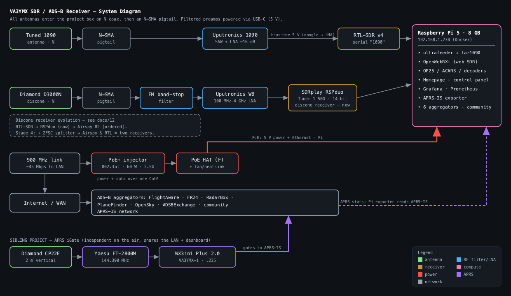

  

  # VA3YMX SDR / ADS-B Receiver

  Dual RTL-SDR v4 station on a Raspberry Pi 5 — ADS-B feeding six flight-tracking
  aggregators, plus a general-purpose web SDR + decoder bench on a discone
  antenna. Headless, near YYZ (Toronto Pearson).

---

## Start here

New to the project? Read the **[README](README.md)** for the architecture, the
one-dongle-one-consumer constraint that shapes everything, and why this replaces
the old `adsb-box` snap. Then work through the build guide below in order.

## System diagram

*Full RF / power / network flow → [docs/10](docs/10-system-diagram.md).*

## Build guide

| # | Doc | What it covers |
|---|-----|----------------|
| 1 | **[Hardware & RF](docs/01-hardware-and-rf.md)** | Pi 5, power/cooling, USB, antennas & filtering, the 900 MHz link |
| 2 | **[OS base setup](docs/02-os-base-setup.md)** | Raspberry Pi OS Lite, headless config, Docker |
| 3 | **[RTL-SDR v4 drivers](docs/03-rtl-sdr-v4-drivers.md)** | v4 driver, DVB blacklist, naming dongles by serial |
| 4 | **[ADS-B feeder](docs/04-adsb-feeder.md)** | ultrafeeder + aggregator containers, gain tuning |
| 5 | **[OpenWebRX+ on the discone](docs/05-openwebrx-discone.md)** | Web SDR, profiles, built-in decoders, link tuning |
| 6 | **[Decoders & trunking](docs/06-decoders-and-trunking.md)** | OP25 / P25, the Ontario encryption reality |
| 7 | **[Operations & maintenance](docs/07-operations.md)** | Updates, backups, monitoring, remote access |
| 8 | **[Migration from adsb-box](docs/08-migration-from-adsb-box.md)** | Recovered keys, old→new mapping, cut-over |
| 9 | **[Integration & dashboards](docs/09-integration-and-dashboards.md)** | WX3in1 APRS tie-in · Homepage portal · Grafana stats for both stations |
| 10 | **[System diagram](docs/10-system-diagram.md)** | The whole station drawn out — RF chains, preamps, power, network, APRS sibling |
| 11 | **[HTTPS (Caddy + DreamHost)](docs/11-https-caddy.md)** | Wildcard cert via DNS-01 · reverse proxy · pfSense rebind fix · http→https redirect |
| 12 | **[Receiver evolution](docs/12-receiver-evolution.md)** | RTL-SDR → RSPduo → Airspy R2 · what works · SDRplay-in-Docker lessons · the splitter plan |

## Config & scripts

| Path | Purpose |
|------|---------|
| [`compose/adsb/`](compose/adsb/) | ADS-B stack — ultrafeeder + 6 aggregator feeders. `.env` holds the migrated keys (private). |
| [`compose/openwebrx/`](compose/openwebrx/) | OpenWebRX+ for the discone (now on the RSPduo via the rsp_tcp bridge). |
| [`compose/acars/`](compose/acars/) | ACARS — `acarsdec` (RSPduo/SoapySDR) + ACARSHub web UI + a custom reader. |
| [`compose/rsp/`](compose/rsp/) | SDRplay RSPduo support — SoapySDR/API base image + the `rsp_tcp` bridge. |
| [`compose/homepage/`](compose/homepage/) | Station portal (Homepage) linking both projects. |
| [`compose/monitoring/`](compose/monitoring/) | Prometheus + Grafana + APRS-IS exporter — unified ADS-B + APRS stats. |
| [`compose/control/`](compose/control/) | Control panel embedded in Homepage — start/stop buttons + discone "mode" switching. |
| [`compose/portainer/`](compose/portainer/) | Optional full container manager (logs, console, stacks). |
| [`compose/caddy/`](compose/caddy/) | HTTPS reverse proxy — wildcard cert (DreamHost DNS-01), fronts every UI. |
| [`scripts/01-install-rtlsdr-v4.sh`](scripts/01-install-rtlsdr-v4.sh) | Installs the v4 driver, blacklists DVB, sets serials. |
| [`scripts/build-html.sh`](scripts/build-html.sh) | Regenerates these HTML pages from the Markdown sources. |

## Station at a glance

| | |
|---|---|
| **Callsign** | VA3YMX |
| **Pi (this project)** | `192.168.1.230` · Raspberry Pi 5 8 GB |
| **Location** | 43.7, −79.5 · ~124 m ASL (14 ft AGL) |
| **ADS-B dongle** | RTL-SDR v4 · serial `1090` · tuned 1090 MHz antenna |
| **General-RF dongle** | RTL-SDR v4 · serial `discone` · Diamond D3000N (25–3000 MHz) + FM band-stop filter |
| **Feeding** | FlightAware · FlightRadar24 · RadarBox · PlaneFinder · OpenSky · ADSBExchange · community aggregators |
| **Sibling project** | Microsat WX3in1 Plus 2.0 APRS iGate `VA3YMX-1` · `192.168.1.235` · Diamond CP22E + Yaesu FT-2800M (144.390 MHz) |

## Quick reference (deployed)

Trusted HTTPS via the Caddy proxy. `http://192.168.1.230/` 301-redirects here.

| Service | URL |
|---------|-----|
| Station portal | `https://station.example.org/` |
| OpenWebRX+ | `https://sdr.example.org/` |
| ADS-B map (tar1090) | `https://adsb.example.org/` (+ `/graphs1090/`) |
| Grafana | `https://grafana.example.org/` |
| Control panel | `https://control.example.org/` |
| Prometheus | `https://prometheus.example.org/` |
| Portainer | `https://portainer.example.org/` |
| APRS iGate (WX3in1) | `http://192.168.1.235/` |

---
To regenerate the HTML after editing any `.md`: <code>./scripts/build-html.sh</code>
